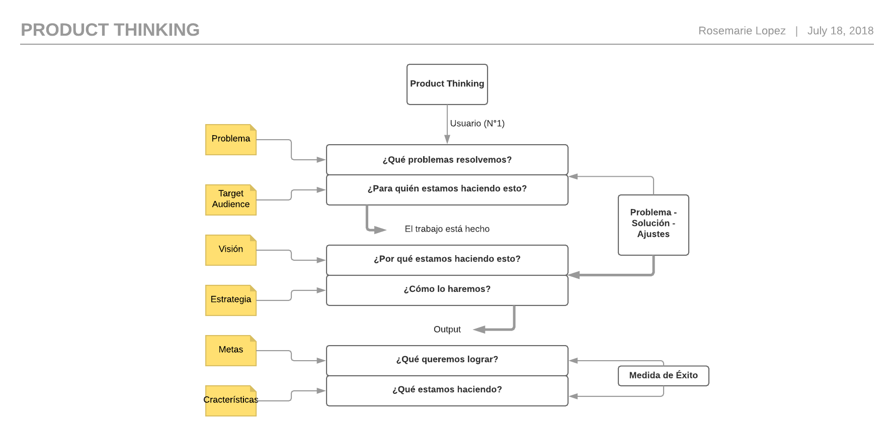
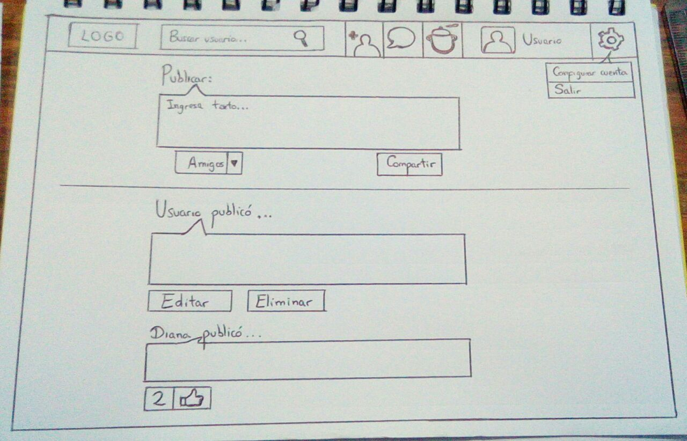

# Creando una Red Social

## Preámbulo

Instagram, Snapchat, Twitter, Facebook, Twitch, Linkedin, etc. Las redes
sociales han invadido nuestras vidas. Las amamos u odiamos, y muchxs no podemos
vivir sin ellas.

Hay redes sociales de todo tipo y para todo tipo de intereses. Por ejemplo,
en una ronda de financiamiento con inversionistas, se presentó una red social
para químicos en la que los usuarios podían publicar artículos sobre sus
investigaciones, comentar en los artículos de sus colegas, y filtrar artículos
de acuerdo a determinadas etiquetas o su popularidad, lo más reciente, o lo
más comentado.

## Introducción

Una emprendedora nos ha encargado crear una red social. No nos da mucho detalle
sobre qué tipo de red social quiere, sólo nos dice que creemos la mejor que
podamos, y que luego la convenzamos de lanzarla al mercado. Nos da ciertos temas
en los que le gustaría invertir:

* Alimentación
* Feminismo
* Educación
* Salud
* Energías Renovables

## Alimentación

La salud y el buen funcionamiento de nuestro organismo, depende de la nutrición y alimentación que tengamos durante la vida.

Alimentación y Nutrición aún cuando parecieran significar lo mismo, son conceptos diferentes.
Los objetivos nutricionales tienen como finalidad promover la salud, reducir el riesgo de desarrollar patologías relacionadas con la alimentación y controlar enfermedades específicas causadas por una ingesta excesiva o insuficiente de ciertos alimentos.
Para lograr tener una alimentación equilibrada debes incluir hidratos de carbono, proteínas, grasas, vitaminas y fibras. Cada uno de estos elementos es parte de la [_Pirámide Alimenticia_](https://do1pouckcwxot.cloudfront.net/mexico/uploads/2018/02/17162821/piramide1.jpg), pero no todos deben ser consumidos en cantidades iguales.

### UX

Benchmark

El benchmarking en Red Social o el análisis de la competencia en redes sociales es una parte imprescindible que forma parte del Plan de Social Media.
Mediante este análisis se determina qué prácticas están haciendo mal los competidores para no caer en ellas y, con qué prácticas están teniendo éxito para tenerlas en cuenta en nuestra estrategia de red social.

El objetivo común de los principales post de comida saludable, en las diversas redes sociales existentes, es demostrar el gran poder nutritivo y de calidad de los alimentos, que a su vez son de fácil acceso y preparación, primordial requisito de los consumidores (usuarios). A continuación un listado de las principales redes con una gran cantidad de seguidores y mayor número de likes.

* Quinoa Story.
* Bio Deli Orgánico.
* La Perita.
* Sano y Light.
* Espresssate Vegan 

### PRODUCT THINKING

Pensar en los productos brinda a los diseñadores la ventaja de crear las características adecuadas para las personas adecuadas. Ayuda a comprender la experiencia del usuario de un producto como un todo; no solo como Diseño de interacción y Visual de características. Se asegura de que los diseñadores aborden los problemas reales de los usuarios y, por lo tanto, reducen el riesgo de crear algo que nadie quiere. Le da el poder de tomar las decisiones correctas cuando se trata de crear características. Además ayuda a desarrollar funciones exitosas, al definir los problemas que aborda el producto, responde a la pregunta "¿por qué construimos este producto?". Definir el público objetivo "¿quién tiene estos problemas?" Y definir la solución "¿cómo lo estamos haciendo?" Proporcionará suficiente orientación para crear una nueva función. Establecer un objetivo ayudará a medir el éxito de esta característica.

### Skech de baja fidelidad

